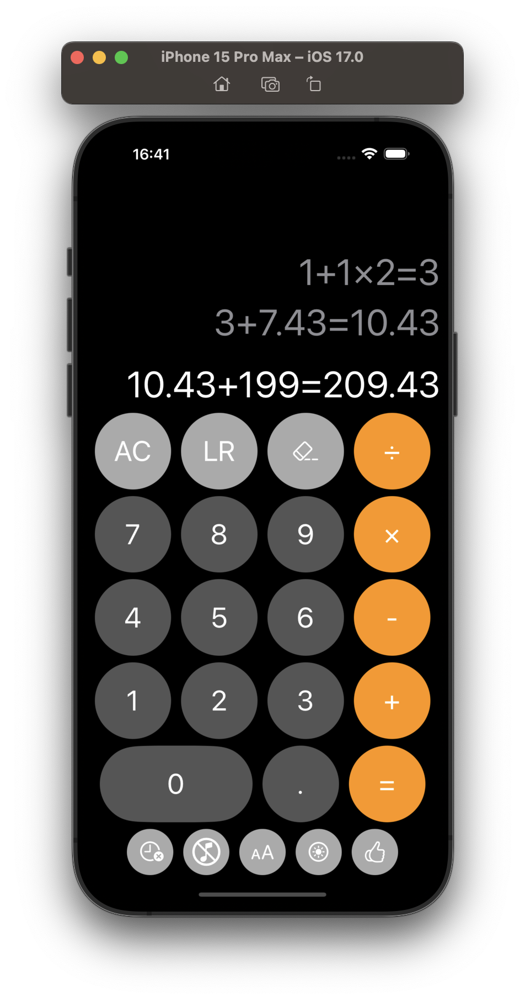

# CalcPlus App

CalcPlus helps you to keep tracking your work with calculation history and good layout resources.

It's designed to:

- Save calculations history
  - vertical slider to show older
- Horizonal slider for big calcs
- Flexible layout:
  - choose the size of the font 
  - dark / light modes
  - animated sound when clicking

<video width="1000" controls>
  <source src="images/calcplus_vid.mov" type="video/mp4">
</video>

